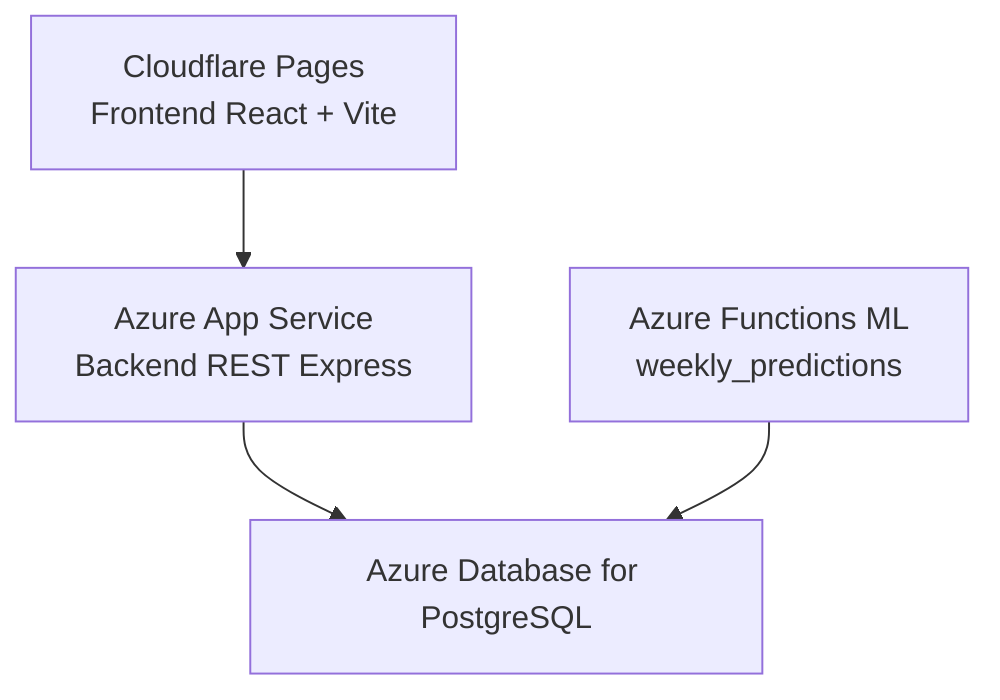

# Despliegue

## Arquitectura de despliegue

Cloudflare Pages sirve el frontend. El frontend consume el backend REST en Azure App Service; no se conecta directamente a PostgreSQL ni a Azure Functions. Azure App Service y Azure Functions comparten la misma base de datos en Azure Database for PostgreSQL, pero cumplen responsabilidades diferentes: App Service atiende las solicitudes HTTP de la API y Functions ejecuta el proceso programado de generación de predicciones.

## Automatización existente

El repositorio tiene tres workflows:

- `backend-test.yml`: en pull requests a `main` y `develop`, inicia PostgreSQL 16, aplica migraciones y ejecuta Jest.
- `frontend-test.yml`: en los mismos pull requests, instala dependencias, ejecuta ESLint y Vitest.
- `azure-backend.yml`: en pushes a `main` que afecten `backend/` o el workflow, además de ejecución manual, prueba y empaqueta el backend y lo despliega a Azure App Service.

El workflow del backend usa inicio de sesión federado de Azure y requiere los secretos de GitHub `AZURE_CLIENT_ID`, `AZURE_TENANT_ID` y `AZURE_SUBSCRIPTION_ID`. Esos nombres se documentan para configuración del workflow; sus valores no deben almacenarse en el repositorio.

## Backend en Azure App Service

La aplicación desplegada es el contenido de `backend/`. El entorno de App Service debe proporcionar al menos `DATABASE_URL`, `JWT_SECRET`, `JWT_REFRESH_SECRET`, `FRONTEND_URL` y, si corresponde, `PORT`/`NODE_ENV`. `DATABASE_URL` apunta a Azure Database for PostgreSQL.

El workflow ejecuta `prisma migrate deploy` solo contra su base PostgreSQL de CI antes de generar el artefacto. La estrategia de migración de la base productiva debe ejecutarse de forma controlada y separada del entorno de pruebas.

## Azure Functions ML

`ml/function_app.py` define una Function App Python con:

- `GET /api/health`, anónimo, que comprueba `SELECT 1` en PostgreSQL;
- `weekly_predictions`, un temporizador que usa `ML_TRAINING_SCHEDULE`, con monitorización habilitada y sin ejecución al iniciar.

El módulo ML está desplegado en Azure Functions. La Function App debe tener configurados el runtime Python, las dependencias de `ml/requirements.txt`, `DATABASE_URL` apuntando a Azure Database for PostgreSQL y `ML_TRAINING_SCHEDULE`. El repositorio no contiene un workflow para publicar esta Function App.

## Frontend en Cloudflare Pages

El frontend está desplegado en Cloudflare Pages. `npm run build` genera la compilación Vite en `frontend/dist`; el proceso de publicación en Cloudflare Pages no está definido por los workflows presentes en este repositorio.

## Verificaciones posteriores

La base de datos está desplegada en Azure Database for PostgreSQL. Después de desplegar backend, comprueba autenticación, acceso a PostgreSQL y una ruta protegida. Desde Cloudflare Pages, comprueba que el frontend consume el backend REST. Después de desplegar Functions, comprueba `/api/health` y revisa la ejecución de `weekly_predictions` en los logs de Azure.
